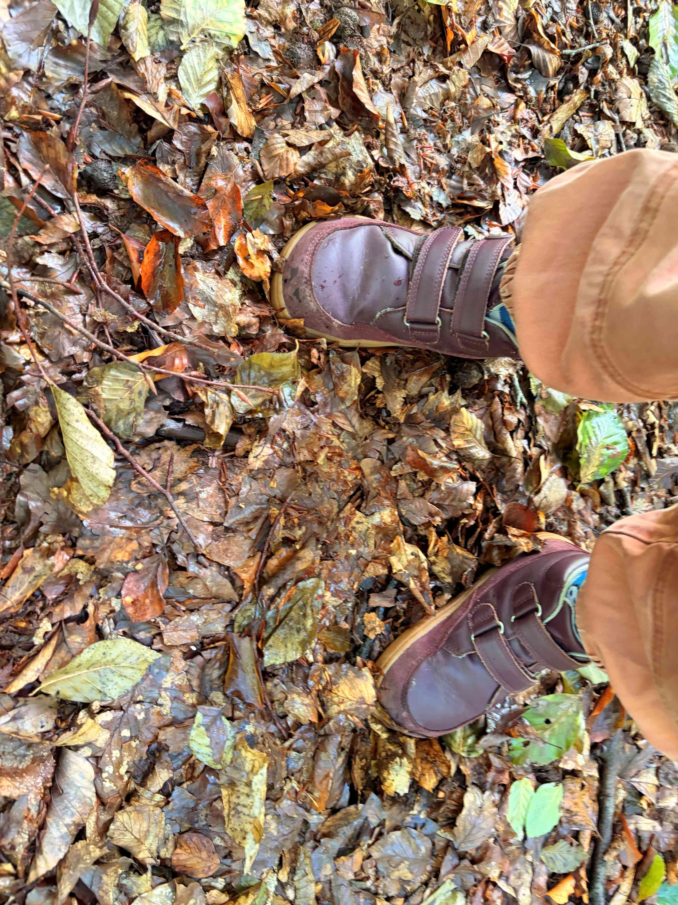

Hello, I'm Nick. 👋

I'm a Lead Product Manager at NHS England, working on digital services for Patients and Staff. Before that I spent 15 years in agencies, financial Services and a startup of my own.

Moving into the public sector has changed how I think about product, so I'm trying to [work in the open(https://roadmap-for-modern-digital-government.campaign.gov.uk/transparency/working-in-the-open/). This site is where I write it down: [weeknotes](https://medium.com/@jukesie/the-why-of-weeknotes-c1cd98967842) on what happened and what I learned, and longer pieces when something warrants more thinking.

The name comes from an old idiom: how do you eat an elephant? One bite at a time. That's how most big problems in the NHS get solved, too.

I hope you'll find it useful, and mildly amusing.

